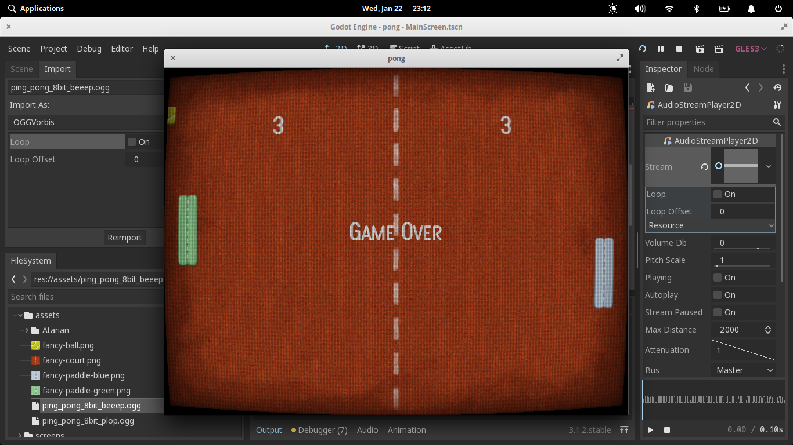

# PongGODOT

The classic pong game created using [Godot](https://godotengine.org/).

# Asset Sources

- Textures from [https://opengameart.org/content/pong-programmer-art](https://opengameart.org/content/pong-programmer-art)
- Fonts from [https://www.1001fonts.com/video-game-fonts.html](https://www.1001fonts.com/video-game-fonts.html)

# TODO

- Add Sound Effects

# Screenshots

